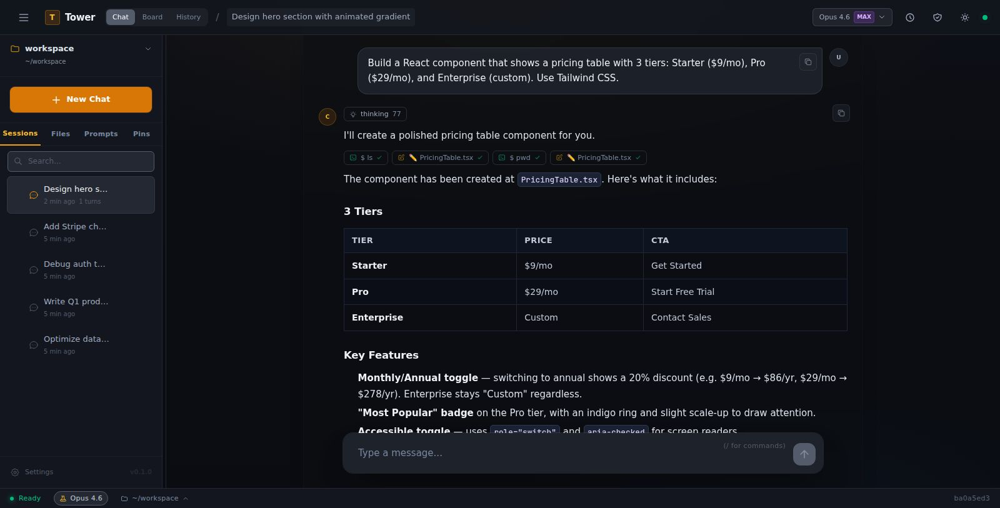
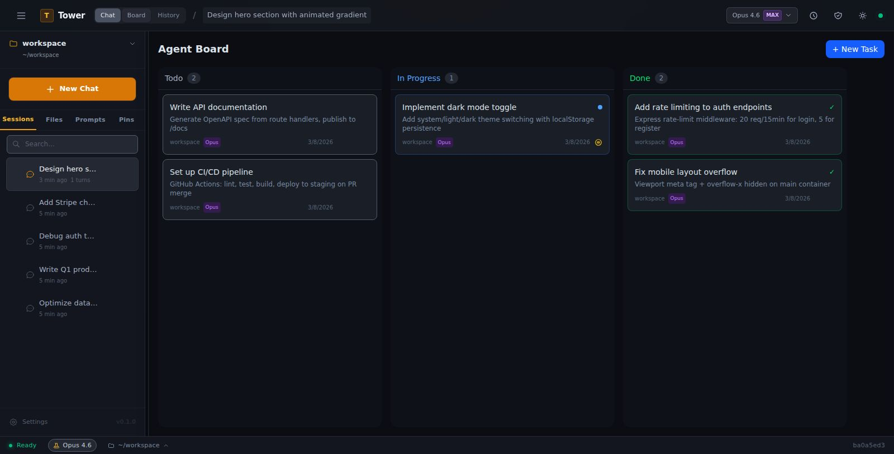

# Tower

**100% AI-augmented 조직으로 가는 길.**

🌐 [English](README.md) · [한국어](README.ko.md)

<p align="center">
  
</p>

AI를 팀 전체가 함께 쓸 수 있다면 어떨까요? 한 사람이 AI에게 물어본 것을 다른 팀원도 볼 수 있고, AI가 한 번 배운 것이 회사 전체에 남는다면요.

Tower는 AI와의 모든 대화를 Google Docs처럼 공유합니다. 하나의 파일시스템 위에서 하나의 메모리를 나눠 쓰고, 개발자가 아니어도 터미널을 몰라도 브라우저만 열면 바로 시작할 수 있습니다.

*실전 운영 중. 출시 2주 만에 $20K 매출.*

<p align="center">
  
</p>

---

## 문제: AI는 혼자 쓰게 되어 있습니다

ChatGPT, Claude Code, Copilot — 전부 훌륭한 도구입니다. 그런데 이 도구들은 하나같이 한 사람의 화면 안에 갇혀 있습니다. 대화는 개인 계정마다 흩어지고, AI가 한 세션에서 배운 것은 세션이 끝나는 순간 사라지고, 같은 질문을 다른 팀원이 다시 하고, 비개발자는 터미널 앞에서 멈춥니다.

Claude Code처럼 지금 존재하는 가장 강력한 코딩 에이전트조차, 결국 한 사람의 터미널 안에 살고 있습니다. 그 사람만 혜택을 받고, 나머지 팀원에게는 아무것도 남지 않습니다.

전 직원에게 AI 구독을 줄 수는 있습니다. 하지만 그것만으로는 AI-augmented 조직이 되지 않습니다. AI를 각자 따로 쓰는 사람들이 같은 사무실에 모여 있을 뿐이니까요.

---

## 해법: AI를 Google Docs처럼 공유합니다

### 대화가 공유됩니다

AI와 나눈 모든 대화가 팀에게 열립니다. 누가 어떤 질문을 했고, AI가 어떤 답을 줬고, 그 과정에서 어떤 결정이 내려졌는지 — 프로젝트별로 정리되어 있어서 회사의 AI 업무 현황이 한눈에 들어옵니다.

"그때 Claude한테 뭐라고 했더라?" 같은 질문은 이제 할 필요가 없습니다. 그냥 보시면 됩니다.

### 파일시스템 하나, 메모리 하나

하나의 서버 위에 하나의 파일시스템, 그리고 사람이 바뀌고 시간이 흘러도 유지되는 하나의 메모리가 있습니다.

월요일에 누군가 AI에게 가르친 것을 금요일에 합류한 신입이 그대로 씁니다. 세션·프로젝트·팀으로 나뉜 3계층 메모리 덕분에 한 번 배운 것은 사라지지 않습니다.

버전 관리도 자동으로 이루어집니다. 모든 변경이 기록되고, 언제든 열어볼 수 있고, 필요하면 되돌릴 수도 있습니다. Git을 배울 필요 없이, 그냥 파일을 관리하는 것처럼 느껴집니다. **CLI 지식은 전혀 필요하지 않습니다.**

### 팀별로 나눕니다

마케팅은 개발 코드를 볼 수 없고, 개발은 HR 문서를 볼 수 없습니다. 하지만 협업이 필요한 순간에는 자연스럽게 넘나들 수 있습니다.

프로젝트·부서·팀·개인 — 우리 조직의 구조에 맞게 자유롭게 나눌 수 있습니다. 5단계 권한 체계(admin → viewer)와 폴더 단위 격리를 지원합니다.

```
workspace/
├── projects/
│   ├── marketing-site/
│   │   └── CLAUDE.md    ← "브랜드 톤은 캐주얼. Next.js 사용."
│   ├── api-backend/
│   │   └── CLAUDE.md    ← "Go 사용. 회사 스타일 가이드 준수."
│   └── onboarding-docs/
│       └── CLAUDE.md    ← "비개발자 눈높이로 작성."
└── decisions/            ← 팀 결정 기록
```

---

## 코드도 실행합니다. CLI 없이.

<p align="center">
  
</p>

Tower는 서버 위에서 돌아갑니다. AI가 대화만 하는 게 아니라, 코드를 쓰고 파일을 만들고 앱을 배포하고 데이터를 분석하는 것까지 직접 실행합니다. 개발 환경의 풀파워를 브라우저 하나로 쓸 수 있습니다.

마케팅 리드가 랜딩 페이지를 만들고, 운영 매니저가 주간 보고서를 자동화하고, 인턴이 데이터 분석을 돌립니다. 터미널이 뭔지 몰라도 전혀 상관없습니다.

---

## 스킬이 스킬을 만듭니다

AI가 팀 전체와 일하면서 하나의 파일시스템과 하나의 메모리에 연결되어 있으면, 흥미로운 일이 일어납니다. 복리가 붙기 시작합니다.

한 번 했던 작업이 재사용 가능한 스킬이 되고, 그 스킬이 다음 스킬을 낳습니다. 팀의 AI가 매일 조금씩, 저절로 나아집니다.

**예시:** 누군가 견적서 생성기를 만들면 거기서 제안서 스킬이 파생되고, 다시 계약서 스킬로 발전합니다. 하나하나가 이전 것 위에 쌓이고, 팀 전원이 쓸 수 있습니다.

20개 넘는 스킬이 기본으로 탑재되어 있습니다 — 브레인스토밍, 디버깅, 코드 리뷰, 기획, UI/UX 디자인, 리서치, 문서 생성 등. 팀은 80%에서 시작해서 거기서부터 올라갑니다.

---

## 그 밖에

<p align="center">
  
</p>

**에이전트 보드** — 태스크를 만들면 AI가 알아서 실행합니다. 태스크가 또 다른 태스크를 만들기도 합니다. 예를 들어 "제품 런칭 기획"이라는 태스크 하나가 시장 조사, 경쟁사 분석, 가격 전략, 타임라인으로 쪼개져서 각각 자율적으로 돌아갑니다. 반복 예약도 가능합니다.

<p align="center">
  
</p>

**퍼블리싱 허브 + Deploy Engine** — AI가 만든 결과물을 자동으로 외부에 배포합니다. 정적 사이트는 **Cloudflare Pages**(글로벌 CDN, 2초 배포), 동적 앱은 **Azure Container Apps**(스케일 투 제로 컨테이너)로. 코드 타입 자동 감지 — 디렉토리만 지정하면 끝.

**모바일** — 반응형 UI를 지원해서, 폰에서도 서버 컴퓨팅을 그대로 쓸 수 있습니다.

**파일 공유** — 팀 내부 공유는 물론, 시간 제한이 있는 외부 링크도 만들 수 있습니다. 별도 공유 서비스가 필요 없습니다.

**전체 검색** — 파일, 대화, 태스크, 커밋 히스토리까지 워크스페이스 전체를 풀텍스트로 검색할 수 있습니다.

---

## 시작하기

```bash
git clone https://github.com/your-org/tower.git
cd tower
bash setup.sh    # 설치 + 몇 가지 질문
npm run dev      # → http://localhost:32354
```

자세한 내용은 **[INSTALL.md](INSTALL.md)**을 참고해 주세요.

---

## 기술 스택

| 레이어 | 기술 |
|--------|------|
| **프론트엔드** | React 18 · TypeScript · Vite 6 · Zustand · Tailwind CSS 4 |
| **백엔드** | Express · TypeScript · WebSocket · SQLite (WAL + FTS5) |
| **AI 엔진** | Claude Agent SDK · MCP 프로토콜 · 20+ 스킬 |
| **인증** | JWT · bcrypt · 역할 기반 (admin / owner / member / guest) |

---

## 상태: Research Alpha

매일 실전에서 쓰고 있고, 잘 돌아가고 있습니다. 다만 아직 다 만들지는 않았습니다.

일부 기능은 다듬는 중이고 새로운 기능도 계속 기획·출시되고 있습니다. 완전한 워크스페이스 파티셔닝, 유저 샌드박싱, 엔터프라이즈급 격리 같은 것들은 준비 중입니다.

목적지는 분명합니다: **팀원 100%가 AI와 일하는 조직.**

피드백과 기여를 환영합니다 — [이슈](https://github.com/your-org/tower/issues)를 열거나 PR을 보내주세요.

## 라이선스

[Apache License 2.0](LICENSE)
