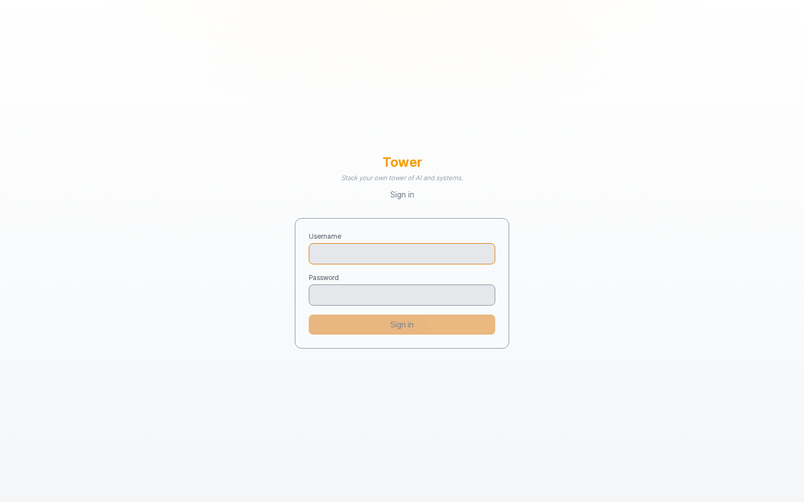
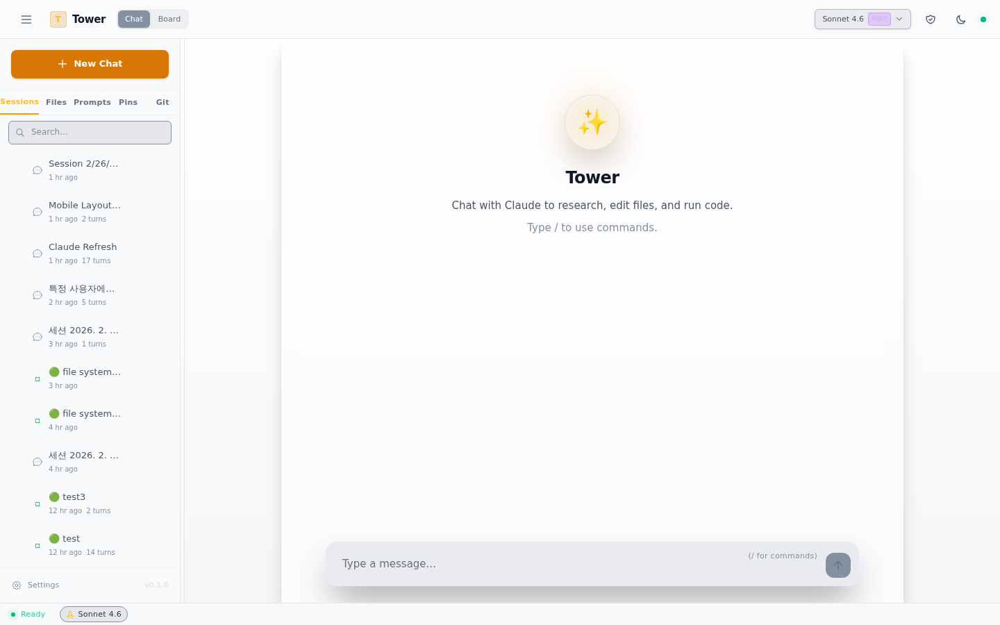
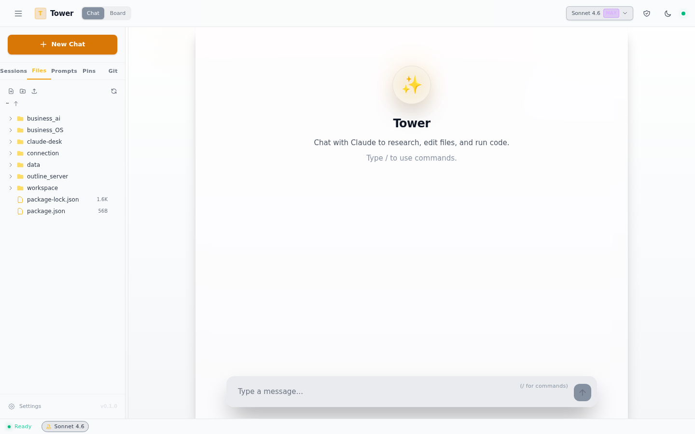
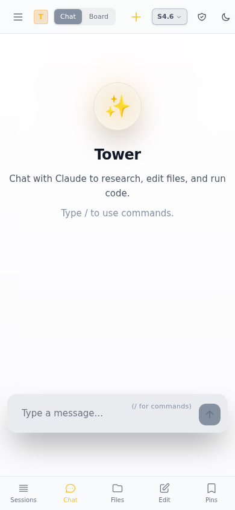

# Tower

**AI command center for your team**

Build your own tower of AI orchestration systems.

---

## Why Tower?

Claude Code is powerful — but it's a single-user CLI. When your team needs AI:

- **"Can everyone SSH into one machine?"** — Not practical, not safe.
- **"Should each person set up their own Claude?"** — Expensive, inconsistent, no shared context.
- **"How do we give non-engineers access to Claude Code?"** — They won't use a terminal.

Tower solves this. One deployment, browser access, your whole team on AI — with shared workspaces, role-based permissions, and persistent memory that makes Claude smarter over time.

**What you get:**
- A web UI with the full power of Claude Code CLI
- Multi-user, multi-session — everyone works simultaneously
- 20 bundled AI skills (brainstorming, TDD, debugging, code review, ...)
- 3-layer memory system — Claude remembers across sessions
- File editor, git integration, admin panel — all in the browser
- Deploy in 5 minutes, access from anywhere via Cloudflare Tunnel

---

## Screenshots

### Login

<p align="center">
  
</p>

### Main (Sessions + File Tree + Chat)

<p align="center">
  
</p>

Switch between sessions, file tree, prompts, pinboard, and git history via sidebar tabs. Chat with Claude in the center panel. Edit files in the right-side Context Panel.

### File Explorer

<p align="center">
  
</p>

Browse your workspace as a file tree. Click any file to open it in the CodeMirror editor.

### Mobile

<p align="center">
  
</p>

Responsive layout with bottom tab bar for mobile.

---

## Features

### Claude Chat
- Real-time streaming via Claude Code SDK (`@anthropic-ai/claude-agent-sdk`)
- Multi-session support (up to 3 concurrent sessions)
- Background session execution with auto-save
- Live tool_use results (file edits, command output)
- Thinking blocks (collapsible)
- Mermaid diagram rendering
- AskUserQuestion intercept — respond to Claude's questions in the browser

### File Management
- Sidebar file tree (real-time via chokidar)
- CodeMirror editor (JS/TS/Python/JSON/Markdown highlighting)
- Drag & drop file upload
- File pinning (favorites)

### Session Management
- AI-generated session names
- Favorites, search, tags
- AI session summaries
- Per-session working directory (CWD)

### Git Integration
- Sidebar git panel (commit history, diffs)
- Auto-commit on Claude edits
- Manual commit, rollback

### Prompt Library
- Save and reuse prompts
- Auto-load command files (`.md`)

### Admin
- User CRUD (create, role change, password reset, disable)
- Per-user workspace restriction (`allowed_path`)
- Role-based permissions: `admin` (full) / `user` (restricted)

### More
- Dark / light theme
- PWA support (offline cache, add to home screen)
- Mobile responsive layout
- Cloudflare Tunnel for remote access

---

## Tech Stack

| Layer | Technology |
|-------|-----------|
| **Frontend** | React 18, Vite 6, Tailwind CSS 4, Zustand 5, CodeMirror |
| **Backend** | Express, WebSocket (ws), tsx watch |
| **AI** | `@anthropic-ai/claude-agent-sdk` (Claude Code SDK) |
| **DB** | SQLite (better-sqlite3), WAL mode |
| **Auth** | JWT (bcryptjs + jsonwebtoken) |
| **Process** | PM2 (production), concurrently (dev) |
| **Other** | Chokidar (file watch), Mermaid (diagrams), PWA (vite-plugin-pwa) |

---

## Quick Start

### Prerequisites

- **Node.js** 20+
- **Claude Code CLI** installed and authenticated (`claude --version`)
- **Anthropic API** key (Max plan or API key)

### One-Step Setup

```bash
git clone <repo-url> tower
cd tower
bash setup.sh
```

The setup wizard will:
1. Check prerequisites (Node.js, Claude CLI)
2. Install npm dependencies
3. Create `.env` from `.env.example`
4. Initialize your workspace directory
5. Install Claude skills and memory hooks

### Manual Setup

If you prefer to set things up step by step:

```bash
# 1. Install dependencies
npm install

# 2. Configure environment
cp .env.example .env
# Edit .env — at minimum, change JWT_SECRET

# 3. Initialize workspace (optional)
# Copy templates/workspace/ to your workspace directory

# 4. Install Claude skills (optional, requires Claude Code CLI)
./install-skills.sh

# 5. Install memory hooks (optional, requires Claude Code CLI)
bash memory-hooks/install.sh
```

### Run

```bash
# Development
npm run dev
# → http://localhost:32354

# Production
npm run build
./start.sh start
```

### First Login

1. Open `http://localhost:32354`
2. Create your **admin account** on first visit
3. Add team members via the admin panel (shield icon in header)

---

## Project Structure

```
tower/
├── backend/
│   ├── index.ts                 # Express + WebSocket server
│   ├── config.ts                # Environment config
│   ├── db/schema.ts             # SQLite schema + migrations
│   ├── routes/
│   │   ├── api.ts               # REST API
│   │   ├── ws-handler.ts        # WebSocket handler
│   │   └── session-guards.ts    # Concurrent session mgmt
│   └── services/
│       ├── auth.ts              # Auth + user management
│       ├── claude-sdk.ts        # Claude Agent SDK wrapper
│       ├── session-manager.ts   # Session CRUD
│       ├── message-store.ts     # Message persistence
│       ├── file-system.ts       # File tree, read/write
│       ├── git-manager.ts       # Git operations
│       └── ...
│
├── frontend/src/
│   ├── App.tsx                  # Main layout
│   ├── components/              # UI components
│   ├── hooks/                   # useClaudeChat, useWebSocket
│   ├── stores/                  # Zustand state management
│   └── utils/                   # Parsers, helpers
│
├── claude-skills/               # Bundled Claude skills
│   ├── skills/                  # 6 skills (ready, swarm, tech-lead, ...)
│   ├── commands/                # Slash commands (prime, gdrive, gmail)
│   └── agents/                  # Agent definitions
│
├── memory-hooks/                # Session memory system
│   ├── install.sh               # One-step installer
│   └── src/                     # Hook scripts (SQLite FTS5)
│
├── templates/
│   └── workspace/               # Workspace template for new deployments
│
├── setup.sh                     # One-step setup wizard
├── start.sh                     # Production server management
├── .env.example                 # Environment variable template
├── ecosystem.config.cjs         # PM2 config
└── package.json
```

---

## Environment Variables

Copy `.env.example` to `.env` and edit:

| Variable | Default | Description |
|----------|---------|-------------|
| `PORT` | `32354` | Server port |
| `HOST` | `0.0.0.0` | Bind address |
| `WORKSPACE_ROOT` | `$HOME/workspace` | Root directory for file browsing |
| `DEFAULT_CWD` | `$WORKSPACE_ROOT` | Default CWD for new sessions |
| `JWT_SECRET` | *(must change)* | JWT signing key |
| `NO_AUTH` | `false` | Set `true` to disable auth |
| `PERMISSION_MODE` | `bypassPermissions` | Claude permission level |
| `MAX_CONCURRENT_SESSIONS` | `10` | Max concurrent sessions |
| `GIT_AUTO_COMMIT` | `true` | Auto-commit Claude edits |
| `DB_PATH` | `data/tower.db` | SQLite database path |
| `CLAUDE_PATH` | *(auto-detect)* | Claude CLI path override |

---

## User Roles

| Role | Claude Permissions | File Access | Admin Panel |
|------|-------------------|-------------|-------------|
| `admin` | `bypassPermissions` | Full | Yes |
| `user` | `acceptEdits` | `allowed_path` only | No |

---

## Claude Skills & Hooks

Tower ships with **20 skills**, 3 commands, and 1 agent — all bundled in the repo.

Categories: workflow (brainstorming, planning, TDD, debugging, code review, ...), domain (tech-lead, UI/UX, swarm), and utilities (ready, humanize).

Install with `./install-skills.sh` (included in `setup.sh`).
See `claude-skills/README.md` for the full list.

### Memory Hooks

A 3-layer memory system that gives Claude persistent memory across sessions:
1. **Auto Memory** — per-project patterns and learning
2. **Workspace Memory** — team decisions and processes
3. **Session Hooks** — SQLite FTS5 auto-capture of session activity

Install with `bash memory-hooks/install.sh` (included in `setup.sh`).
See `memory-hooks/README.md` for details.

---

## Remote Access (Cloudflare Tunnel)

```bash
# Install cloudflared (one-time)
# https://developers.cloudflare.com/cloudflare-one/connections/connect-networks/downloads/

# Quick Tunnel (temporary URL, no account needed)
cloudflared tunnel --url http://localhost:32354
```

The output URL (`https://xxx.trycloudflare.com`) gives you HTTPS access from anywhere.

> Quick Tunnel URLs change on restart. For a permanent URL, use a [Named Tunnel](https://developers.cloudflare.com/cloudflare-one/connections/connect-networks/get-started/).

---

## Server Management

```bash
./start.sh start     # Build + start with PM2
./start.sh stop      # Stop
./start.sh restart   # Rebuild + restart
./start.sh logs      # View logs
./start.sh status    # Check status
```

---

## License

Licensed under the [Apache License 2.0](LICENSE).
