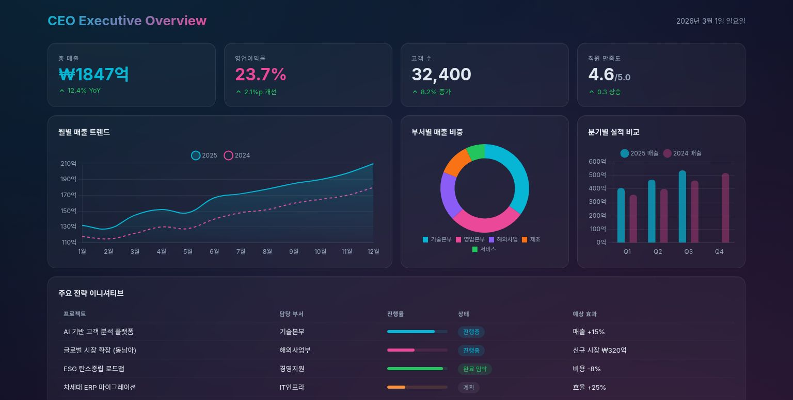
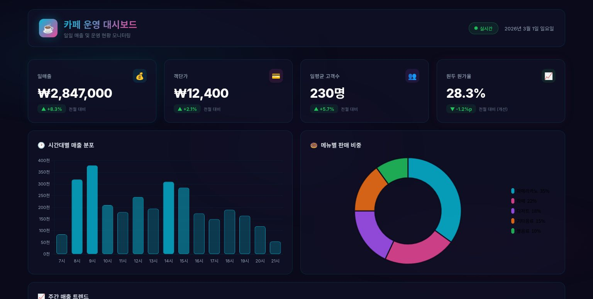

# Tower

**Your team's AI work layer.**

For the first time, see not just what your team produced — but how it happened.

[**한국어 README**](README.ko.md)

---

## The Big Picture

Every day, your team produces work. Code gets written, decisions get made, documents get created, problems get solved.

But where does all that actually *happen*? In scattered terminals. In Slack threads. In someone's head. In a Claude session that closes at the end of the day and disappears.

**Tower changes that.**

When all AI-assisted work flows through one place — sessions recorded, decisions logged, file changes committed with attribution, memory persisting across users and time — something new becomes possible:

You can actually see *how* your company works. Not just what it produced.

---

## Why This Matters

Most tools capture **outputs**:

| Tool | Captures |
|------|----------|
| Jira | Ticket status |
| GitHub | Final code |
| Slack | Message fragments |
| Notion | Polished documents |
| **Tower** | **The process that created all of it** |

None of them capture how work actually happens — the reasoning, the trade-offs, the back-and-forth that led to the decision.

Tower captures the process.

When your team routes their AI work through Tower, you get a living record of:
- **What** was decided — and **why** (the Claude conversation is right there)
- **Who** did what — git commits tagged by user and session
- **What's happening right now** — active sessions with real-time visibility
- **What the team has learned** — persisted in shared memory that makes Claude smarter for everyone

---

## The Problem With Claude Code (Not Claude's Fault)

Claude Code is freakishly powerful. But let's be honest:

**It's a terminal app.** Your project managers, designers, analysts, and clients aren't going to learn the CLI. They just won't.

**It lives on one machine.** Your carefully configured skills, CLAUDE.md, workspace context — all locked to one device.

**It needs an expert.** Without proper setup, you're using maybe 20% of what Claude Code can do. Most teams never get there.

**And it doesn't share.** Sessions disappear. Context resets. What one person learns, nobody else benefits from.

Tower fixes all of this — and adds something more.

---

## How It Works

```
Team member opens browser
      ↓
Works with Claude (code, docs, decisions, research...)
      ↓
Everything flows through Tower
      ↓
Sessions recorded · Files committed · Memory updated · Context shared
      ↓
Next session starts smarter.
Next team member starts with context.
Next decision builds on the last.
```

The longer your team uses Tower, the more it knows. The more it knows, the better it performs. **It's a flywheel.**

---

## From Conversation to Collaboration

Most AI tools give you a chat window. You type. It responds. The conversation ends. Tomorrow you start over.

Tower is built on a different premise: **AI should be a coworker, not a chatbot.**

When you work through Tower, you're not sending messages into a void — you're directing an agent that reads your files, writes code, generates documents, commits changes, and remembers what it learned. You watch it work in real time. You course-correct mid-stream. You build on what it built yesterday.

This isn't a new interface for the same thing. It's a different architecture for a different relationship with AI.

| Chatting with AI | Working with AI |
|---|---|
| One question, one answer | Persistent sessions across days and weeks |
| Context resets every conversation | Memory accumulates across the team |
| Output lands in your clipboard | Output lands in version-controlled files |
| Only you benefit | The whole team benefits |
| You talk *to* AI | You and AI build *together* |

Tower is the architecture that makes this transition possible — browser access, persistent memory, file system, git integration, role-based collaboration, and mobile access all working as one.

---

## What You Get

### 🌐 Browser Access
Anyone on your team — developer, designer, PM, analyst — can use the full power of Claude Code without a terminal. Role-based permissions mean admins get full access, regular users get guardrails.

### 🧠 3-Layer Team Memory

1. **Auto memory** — Claude's native MEMORY.md, loaded every conversation
2. **Workspace memory** — Shared decisions and learnings, persisted across the team
3. **Activity hooks** — Automatic logging of edits, commands, and sessions with full-text search

What one person learns becomes what Claude knows for everyone.

### 👁 Work Visibility
- See active sessions across your team in real-time
- Every file change committed with user + session attribution
- Decision records in `decisions/` — the *why* behind the *what*
- Session history that doesn't disappear when someone closes their browser

### 📋 20 Bundled Skills
Brainstorming, TDD, debugging, code review, planning, UI/UX design — pre-configured and ready. Your team starts at 80%, not 20%.

### 🔒 Role-Based Access
- **Admins**: full workspace access, `bypassPermissions` mode
- **Users**: restricted to their `allowed_path`, `acceptEdits` mode
- **File sharing**: internal (team) or external (expiring public links)

### 🔧 Git Integration
Auto-commit on every Claude edit. Every change is tracked, attributed, and reversible. Roll back to any point in history.

### 📄 Built-in Document Viewer — Zero Install, Instant Preview

Ask Claude to create a report, a dashboard, a proposal, meeting notes — and see the result **immediately**. No downloads. No extra apps. No "open this file in another program."

Tower renders HTML, Markdown, and PDF files directly in its built-in viewer:

- **HTML** — Interactive dashboards, styled reports, and landing page mockups render in a sandboxed preview, complete with charts and animations
- **Markdown** — Full GFM support with syntax highlighting, tables, and images. Write docs in `.md` and they look as polished as Notion pages
- **PDF** — Contracts, invoices, specs — viewable inline without leaving Tower

**Why this matters for non-developers:**

Most AI tools generate files that end up in a folder somewhere. You have to find them, figure out how to open them, maybe install something. Tower skips all of that. The file appears in a side panel the moment it's created — preview on the left, conversation on the right.

This turns your workspace into something that feels like **Notion or a shared wiki** — except everything is generated and organized by AI, versioned with git, and searchable across your entire team's history.

<p align="center">
  
</p>
<p align="center"><em>Ask Claude to build a dashboard → see it live in seconds. No setup required.</em></p>

<p align="center">
  
</p>
<p align="center"><em>From executive overviews to shop-floor ops — any HTML renders right inside Tower.</em></p>

### 📱 Mobile — Your AI, Wherever You Are

Tower runs in any browser. On your phone, that unlocks something powerful:

**Voice-first workflow.** Tap the microphone on your phone's keyboard and speak. Your device's native dictation converts speech to text — no extra app, no speech-to-text API, no configuration. Just talk to Claude like you'd talk to a colleague. This makes Tower accessible to people who would never type a command.

**Full server power in your pocket.** Your phone isn't doing the computation. It's a remote control. Claude runs on your server with its full CPU, memory, and disk. Heavy tasks — data analysis, code generation, document creation, file operations across thousands of files — execute at server speed, not phone speed. You get the portability of a phone with the horsepower of a workstation.

**Sessions on the go.** Waiting for a flight? Riding the subway? Spin up a new session, dictate a batch of instructions, and let Claude work while you move. Spin up five sessions in a row if you want. Come back to your desk and everything is there — files committed, context saved, ready to continue.

```
Your phone (anywhere)          Your server (always on)
    ┌──────────┐               ┌──────────────────┐
    │  Voice   │──── wifi ────▶│  Claude Code      │
    │  input   │   or cell     │  Full CPU/RAM     │
    │  + eyes  │◀─────────────│  Git, files, DB   │
    └──────────┘   live result │  20 skills        │
                               └──────────────────┘
```

This is what "mobile AI" actually means — not a stripped-down chat app, but full access to your team's entire AI workspace from anywhere in the world.

---

## The Flywheel

```
Day 1:    Team starts using Tower
Week 1:   Claude learns team conventions, decisions begin accumulating
Month 1:  New hire onboards → Claude already knows the project context
Month 3:  "Why did we build it this way?" → Open the session, it's right there
Month 6:  Team is faster. Claude is smarter. Work is visible.
Year 1:   Institutional memory that doesn't walk out the door.
```

---

## Get Started

```bash
git clone https://github.com/juliuschun/tower.git
cd tower
bash setup.sh    # installs everything, asks you a few questions
npm run dev      # → http://localhost:32354
```

See **[INSTALL.md](INSTALL.md)** for detailed setup, environment variables, project structure, and deployment options.

---

## What's Included

| | |
|---|---|
| **20 AI Skills** | Brainstorming, TDD, debugging, code review, planning, UI/UX design, and more. See [`claude-skills/README.md`](claude-skills/README.md). |
| **3-Layer Memory** | Auto memory + workspace memory + session hooks. Claude remembers across sessions. See [`memory-hooks/README.md`](memory-hooks/README.md). |
| **Workspace Templates** | Team principles, decision records, shared docs — bootstrapped by `setup.sh`. |
| **File Editor + Viewer** | CodeMirror editor with syntax highlighting, plus a built-in document viewer that renders HTML, Markdown, and PDF — no extra software needed. |
| **Git Integration** | Auto-commit on Claude edits, commit history, diff viewer, rollback. |
| **Admin Panel** | User management, role-based permissions, per-user workspace restrictions. |
| **Mobile + Voice** | Responsive layout, bottom tab bar, PWA support. Use your phone's native dictation to command Claude with full server computing power — from anywhere. |

---

## Demo

### Chat with Claude Code — in the browser

<p align="center">
  <video src="capture.mp4" width="720" controls></video>
</p>

### Build and share dashboards — on the fly

<p align="center">
  <video src="capture2.mp4" width="720" controls></video>
</p>

---

## Screenshots

<p align="center">
  
</p>
<p align="center">
  
</p>
<p align="center">
  
</p>
<p align="center">
  
</p>

---

> Fair warning: this has bugs. It will be updated at will. But it works, and we use it every day.

---

## License

Licensed under the [Apache License 2.0](LICENSE).
