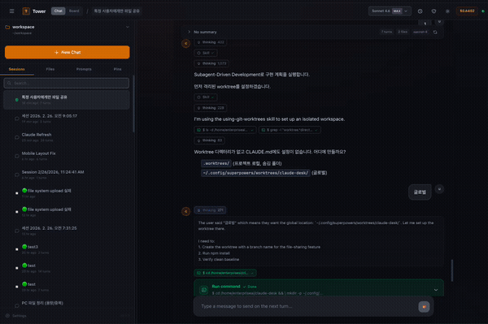
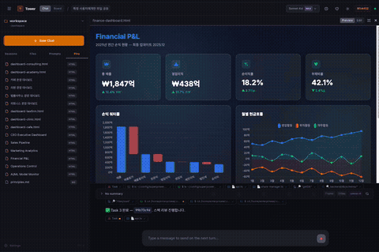

# Tower

**AI command center for your team**

Build your own tower of AI orchestration systems.

[**한국어 README**](README.ko.md)

---

## Why Tower?

Claude Code is freakishly powerful. But let's be honest about the problems.

**It's a terminal app.** Most people on your team — the project managers, the designers, the clients, your family members who keep asking "can your AI help me with this?" — they're not going to learn the CLI. They just won't.

**It lives on one machine.** You can't hand someone your laptop and say "here, use my Claude." It's not portable. It's not shareable. Your carefully configured skills, your CLAUDE.md, your workspace context — all locked to one device.

**It needs an expert.** Getting the full power out of Claude Code means setting up skills, configuring permissions, managing file systems, writing system prompts. That takes someone who knows what they're doing. Without that, you're using maybe 20% of what it can do.

**And even then, you can't share it.** You can't share your sessions with teammates. You can't let someone pick up where you left off. You can't build shared context that makes Claude smarter for everyone.

Yes, `--dangerously-skip-permissions` is scary. The warning is there for a reason — you could get into all sorts of trouble. But having **no option** to give your team browser-based access to Claude Code? That's worse.

### What Tower does

Inspired by [OpenClaw](https://github.com/anthropics/openclawai), Tower is the **team version** — where everyone collaborates with one customized, informed AI that you grow together.

- **Browser access** — anyone on your team can use Claude, no terminal required
- **Shared workspace** — decisions, memory, and context that persist across sessions and users
- **20 bundled skills** — brainstorming, TDD, debugging, code review, planning — ready out of the box
- **3-layer memory** — Claude remembers what your team has done, decided, and learned
- **Role-based access** — admins get full power, regular users get guardrails
- **Deploy once, use everywhere** — Cloudflare Tunnel gives you HTTPS access from anywhere

This is AI + human-in-the-loop, for real. Not a demo. Not a wrapper. A working system where your whole team builds on top of Claude Code together.

> Fair warning: this has bugs. It will be updated at will. But it works, and we use it every day.

---

## Demo

### Chat with Claude Code — in the browser

<p align="center">
  
</p>

### Build and share dashboards — on the fly

<p align="center">
  
</p>

---

## Screenshots

<p align="center">
  
</p>
<p align="center">
  
</p>
<p align="center">
  
</p>
<p align="center">
  
</p>

---

## Get Started

```bash
git clone https://github.com/juliuschun/tower.git
cd tower
bash setup.sh    # installs everything, asks you a few questions
npm run dev      # → http://localhost:32354
```

See **[INSTALL.md](INSTALL.md)** for detailed setup, environment variables, project structure, and deployment options.

---

## What's Included

| | |
|---|---|
| **20 AI Skills** | Brainstorming, TDD, debugging, code review, planning, UI/UX design, and more. See [`claude-skills/README.md`](claude-skills/README.md). |
| **3-Layer Memory** | Auto memory + workspace memory + session hooks. Claude remembers across sessions. See [`memory-hooks/README.md`](memory-hooks/README.md). |
| **Workspace Templates** | Team principles, decision records, shared docs — bootstrapped by `setup.sh`. |
| **File Editor** | CodeMirror with syntax highlighting, real-time file tree, drag & drop upload. |
| **Git Integration** | Auto-commit on Claude edits, commit history, diff viewer, rollback. |
| **Admin Panel** | User management, role-based permissions, per-user workspace restrictions. |
| **Mobile** | Responsive layout with bottom tab bar. PWA support. |

---

## License

Licensed under the [Apache License 2.0](LICENSE).
