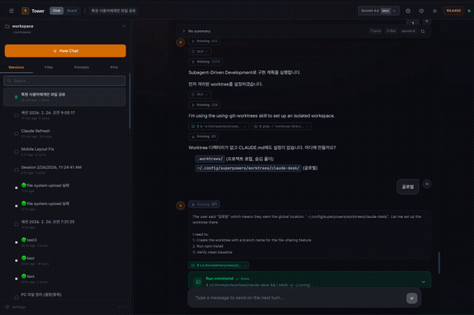
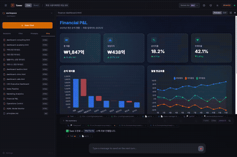

# Tower

**AI collaborator that builds its own tools.**

Your team gives commands. Tower orchestrates the process. The results accumulate. The tools get sharper. What starts as a chatbot becomes your team's **self-evolving central intelligence.**

🌐 [English](README.md) · [한국어](README.ko.md)

<p align="center">
  
</p>

---

## The Big Picture

Every day, your team produces work. Code gets written, decisions get made, documents get created, problems get solved.

But where does all that actually *happen*? In scattered terminals. In Slack threads. In someone's head. In a Claude session that closes at the end of the day and disappears.

**Tower changes that.**

When all AI-assisted work flows through one place — sessions recorded, decisions logged, file changes committed with attribution, memory persisting across users and time — something new becomes possible:

You can actually see *how* your company works. Not just what it produced.

| Tool | Captures |
|------|----------|
| Jira | Ticket status |
| GitHub | Final code |
| Slack | Message fragments |
| Notion | Polished documents |
| **Tower** | **The process that created all of it** |

---

## From Chat to Collaboration

Most AI tools are stuck in the **1:1 conversation** paradigm. You type. It responds. The conversation ends. Tomorrow you start over.

Tower is built for **n:1 collaboration** — where the entire team works with one AI that learns, remembers, and grows.

| | Legacy AI (1:1) | **Tower (n:1)** |
|---|---|---|
| **Who uses it** | One developer in a terminal | **Entire team in a browser** |
| **What comes out** | Conversations that vanish | **Real artifacts — code, docs, decisions** |
| **Where context lives** | Locked on one machine | **Shared team memory** |
| **How it grows** | Static — waits for updates | **Self-evolving — builds its own tools** |
| **The human role** | Typing prompts | **Directing, correcting, orchestrating** |

The key difference: **human in the loop.** Your team doesn't just use Tower — they shape it. Every correction, every decision, every workflow you run through it makes the system more precise. The AI absorbs your team's processes and grows alongside you.

---

## Three Gaps in Solo AI

Claude Code is freakishly powerful. But it was designed for solo use. In a team, three gaps open up:

**The Context Gap.** It doesn't understand the *why* behind your team's architecture. Every session starts cold. What one person learns, nobody else benefits from.

**The Access Gap.** It's a terminal app. Your project managers, designers, analysts, and clients aren't going to learn the CLI. They just won't.

**The Growth Gap.** It can only use the tools it shipped with. Your team's unique workflows — the ones that actually define how you work — stay manual.

Tower closes all three.

---

## What Makes Tower Different

### 🛠 Self-Evolving Skills

This is the core of Tower. It doesn't just run tasks — it **builds the machinery to run them better.**

Tower ships with 20+ skills — brainstorming, TDD, debugging, code review, planning, UI/UX design — and creates new ones as your team works. Today's one-off task becomes tomorrow's one-click skill.

- **Autonomous Tooling** — It architects new scripts and workflows for your team's unique problems
- **Persistent Mastery** — Once a skill is learned, it's stored and available for everyone
- **Compound Growth** — Each human correction makes every future run more precise

Your team starts at 80%, not 20%. And it only goes up from there.

### 🧠 Centralized Team Brain

Three layers of memory that turn individual work into collective intelligence:

1. **Auto memory** — Claude's native context, loaded every conversation
2. **Workspace memory** — Shared decisions and learnings, persisted across the team
3. **Activity hooks** — Automatic logging of edits, commands, and sessions with full-text search

What one person learns becomes what Claude knows for everyone.

### 🌐 Browser-First, Role-Based

Anyone — developer, designer, PM, analyst — uses the full power of Claude Code without a terminal. Admins get full access, regular users get guardrails, everyone gets the same team brain.

### 📂 Project-Scoped Conversations

This is what makes Tower feel like a team workspace, not a chatbot.

Every project gets its own folder, its own `CLAUDE.md` instructions, and its own conversation history. When someone opens a chat inside a project, Claude automatically works in that project's directory — reading its context, writing its files, following its rules.

```
workspace/
├── projects/
│   ├── marketing-site/
│   │   ├── CLAUDE.md          ← "Use Next.js. Brand voice is casual."
│   │   └── (Claude works here)
│   ├── api-backend/
│   │   ├── CLAUDE.md          ← "Use Go. Follow company style guide."
│   │   └── (Claude works here)
│   └── onboarding-docs/
│       ├── CLAUDE.md          ← "Write for non-technical readers."
│       └── (Claude works here)
├── decisions/                  ← Team decision records
└── memory/MEMORY.md            ← Shared context across all projects
```

The result: **Claude doesn't mix up your projects.** Marketing copy doesn't leak into your API code. Your backend conventions don't override your docs style. Each project is its own context — but all of them share the same team memory.

New team member joins the marketing project? Claude already knows the brand voice, the tech stack, and the decisions that got them there. No onboarding document needed — the `CLAUDE.md` *is* the onboarding.

### 📄 Instant Document Viewer

Ask Claude to create a report, a dashboard, a proposal — see it **immediately** in a built-in viewer. HTML with charts, Markdown with syntax highlighting, PDF inline. No downloads, no extra apps. It feels like Notion — except everything is AI-generated, git-versioned, and searchable.

<p align="center">
  
</p>

### 🔧 Git Integration

Auto-commit on every Claude edit. Every change is tracked, attributed, and reversible. Roll back to any point in history.

### 📱 Mobile + Voice

Your phone is a remote control for your server. Tap the mic, speak, and Claude executes with full CPU/RAM. Sessions on the subway, results on your desk.

```
  Your phone (anywhere)             Your server (always on)
  ┌─────────────────┐               ┌─────────────────────┐
  │                 │── wifi/cell ──▶│  Claude Code         │
  │  Voice + eyes   │               │  Full CPU/RAM        │
  │                 │◀── live ──────│  Git, files, DB      │
  │                 │    result     │  20+ skills          │
  └─────────────────┘               └─────────────────────┘
```

---

## The Flywheel

```
Day 1:    Team starts using Tower
Week 1:   Claude learns team conventions, decisions accumulate
Month 1:  New hire onboards → Claude already knows the project
Month 3:  "Why did we build it this way?" → The session is right there
Month 6:  Team is faster. Claude is smarter. Work is visible.
Year 1:   Institutional memory that doesn't walk out the door.
```

---

## Tech Stack

| Layer | Technology |
|-------|------------|
| **Frontend** | React 18 · TypeScript · Vite 6 · Zustand · Tailwind CSS 4 · CodeMirror 6 |
| **Backend** | Express · TypeScript · tsx watch · WebSocket (ws) |
| **Database** | SQLite (better-sqlite3) · WAL mode · FTS5 full-text search |
| **AI Engine** | Claude Agent SDK (`@anthropic-ai/claude-agent-sdk`) |
| **Integrations** | MCP protocol · Git (native) · PWA · chokidar file watcher |
| **Auth** | JWT · bcrypt · Role-based access (admin / owner / member / guest) |

---

## Get Started

```bash
git clone https://github.com/juliuschun/tower.git
cd tower
bash setup.sh    # installs everything, asks you a few questions
npm run dev      # → http://localhost:32354
```

See **[INSTALL.md](INSTALL.md)** for detailed setup, environment variables, project structure, and deployment options.

---

## What's Included

| | |
|---|---|
| **20+ AI Skills** | Brainstorming, TDD, debugging, code review, planning, UI/UX design, and more. See [`claude-skills/README.md`](claude-skills/README.md). |
| **3-Layer Memory** | Auto memory + workspace memory + session hooks. See [`memory-hooks/README.md`](memory-hooks/README.md). |
| **Workspace Templates** | Team principles, decision records, shared docs — bootstrapped by `setup.sh`. |
| **File Editor + Viewer** | CodeMirror editor + built-in document viewer (HTML, Markdown, PDF). |
| **Git Integration** | Auto-commit on Claude edits, commit history, diff viewer, rollback. |
| **Admin Panel** | User management, role-based permissions, per-user workspace restrictions. |
| **Kanban Board** | Task management with drag-and-drop, AI-powered task execution. |
| **Mobile + Voice** | Responsive PWA. Native dictation → full server compute from anywhere. |

---

> Fair warning: this has bugs. It will be updated at will. But it works, and we use it every day.

---

## License

Licensed under the [Apache License 2.0](LICENSE).
