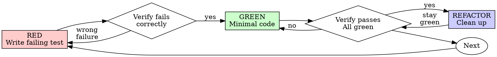

# Test-Driven Development (TDD)

## Overview

Write the test first. Watch it fail. Write minimal code to pass.

If you didn't watch the test fail, you don't know if it tests the right thing.

## When to Use

- New features, bug fixes, refactoring, behavior changes
- Exceptions: throwaway prototypes, generated code, configuration files

## Red-Green-Refactor



### RED — Write Failing Test

Write one minimal test showing what should happen.

```typescript
test('retries failed operations 3 times', async () => {
  let attempts = 0;
  const operation = () => {
    attempts++;
    if (attempts < 3) throw new Error('fail');
    return 'success';
  };

  const result = await retryOperation(operation);

  expect(result).toBe('success');
  expect(attempts).toBe(3);
});
```

Requirements: one behavior, clear name, real code (no mocks unless unavoidable).

### Verify RED — Watch It Fail

Run the test. Confirm:
- Test fails (not errors)
- Failure message is expected
- Fails because feature is missing (not typos)

### GREEN — Minimal Code

Write simplest code to pass the test. Don't add features beyond what the test requires.

### Verify GREEN — Watch It Pass

Run the test. Confirm:
- Test passes
- Other tests still pass
- Output clean (no errors, warnings)

### REFACTOR — Clean Up

After green only: remove duplication, improve names, extract helpers. Keep tests green.

### Repeat

Next failing test for next feature.

## Good Tests

| Quality | Good | Bad |
|---------|------|-----|
| **Minimal** | One thing. "and" in name? Split it. | `test('validates email and domain and whitespace')` |
| **Clear** | Name describes behavior | `test('test1')` |
| **Shows intent** | Demonstrates desired API | Obscures what code should do |

## Bug Fix Flow

Bug found? Write failing test reproducing it. Follow TDD cycle. Test proves fix and prevents regression.

## When Stuck

| Problem | Solution |
|---------|----------|
| Don't know how to test | Write wished-for API. Write assertion first. |
| Test too complicated | Design too complicated. Simplify interface. |
| Must mock everything | Code too coupled. Use dependency injection. |
| Test setup huge | Extract helpers. Still complex? Simplify design. |

## Verification Checklist

Before marking work complete:

- [ ] Every new function/method has a test
- [ ] Watched each test fail before implementing
- [ ] Wrote minimal code to pass each test
- [ ] All tests pass
- [ ] Tests use real code (mocks only if unavoidable)
- [ ] Edge cases and errors covered
