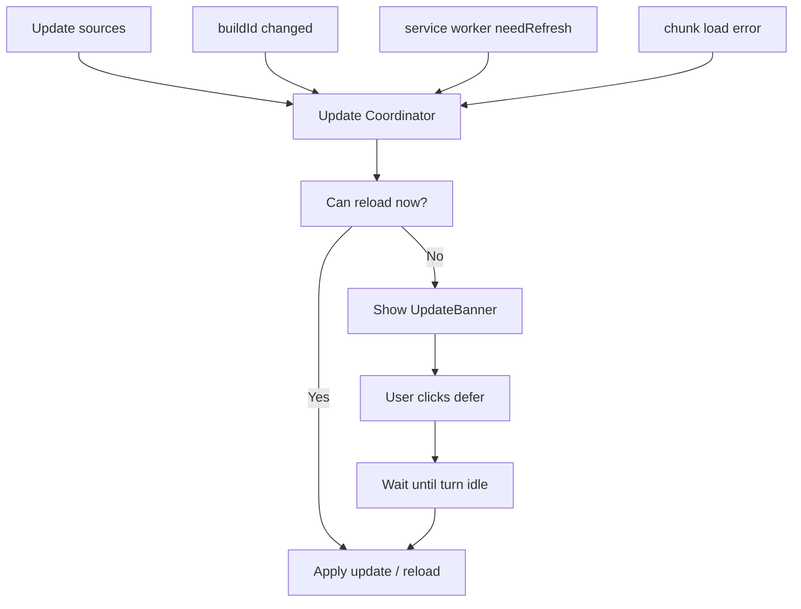
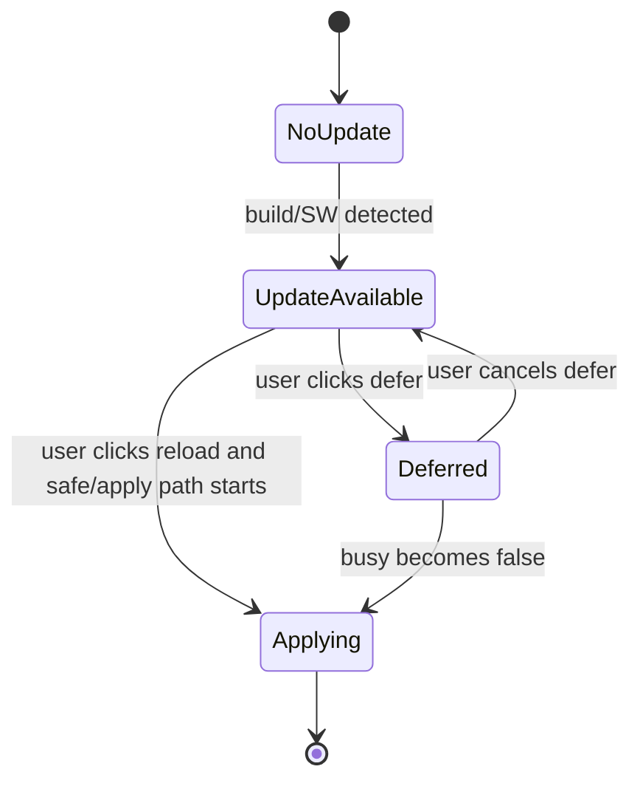

# Architecture Plan — 0412
## Update / Reload Coordinator for Tower Frontend

작성일: 2026-04-12 (Phase 0/2 구현 반영)
상태: Phase 0 + Phase 2 완료 / Phase 4는 보류
범위: Tower frontend runtime, PWA update flow, deploy/restart recovery UX

---

## 1. 왜 이 문서를 쓰는가

최근 Tower 프론트엔드에서는 다음 문제들을 순차적으로 다뤘다.

1. 채팅 런타임이 엔진별 이벤트 리듬 차이 때문에 흔들리는 문제
2. turn phase 기반 상태 표시로 Pi / Claude UI를 더 통일하는 작업
3. queue, tool running, todo live 표시를 세션 상태 기준으로 안정화하는 작업
4. 서버 재시작 / 배포 후 하드 리프레시가 자주 필요했던 문제
5. 새 build 감지, chunk-load recovery, update banner, deferred update까지 추가한 상태

이제 문제는 “기능이 없어서”가 아니라, **업데이트/리로드 관련 판단 로직이 여러 파일에 퍼져 있다는 점**이다.

현재는 동작 자체는 좋아졌지만, 다음 판단이 여러 레이어에 분산되어 있다.

- 새 build를 언제 감지하는가
- service worker가 실제 새 버전을 준비했는가
- 지금 자동 reload가 안전한가
- 작업 중이면 배너를 띄울지, 예약할지, 바로 적용할지
- chunk load error가 났을 때 한 번 자동 복구할지
- offline 상태에서 reload 버튼은 어떤 행동을 해야 하는가

이 문서는 위 판단을 **하나의 업데이트 코디네이터(update coordinator)** 로 정리하기 위한 설계 문서다.

---

## 2. 현재까지 구현된 상태 요약

### 2.1 이미 들어간 기능

현재 코드베이스에는 다음 기능이 들어가 있다.

#### A. 새 build 감지
- 백엔드 `/api/config`, `/api/health`가 `buildId`를 내려줌
- 값은 `config.serverEpoch` 기반
- 프론트는 `/api/config` fetch 시 이전 build와 새 build를 비교함

#### B. chunk load error 1회 자동 복구
- `ErrorBoundary`에서 lazy chunk import 오류를 감지
- `reloadOnce('chunk-load-error')` 수행
- reload 루프 방지를 위해 sessionStorage flag 사용

#### C. 업데이트 배너
- `UpdateBanner`가 새 버전 준비 상태를 상단에 표시
- 작업 중이면 강제 reload 대신 사용자에게 안내

#### D. deferred update
- 사용자가 `턴 끝나면 업데이트`를 선택 가능
- `deferredUpdateRequested` 상태가 저장됨
- 앱이 `busy → idle`로 넘어가면 자동 업데이트 수행

#### E. service worker update lifecycle 연결
- `virtual:pwa-register`의 `registerSW()` 연결
- `onNeedRefresh()`에서 앱 상태에 updateAvailable 반영

#### F. PWA 캐시 완화
- precache에서 `html` 제외
- 오래된 app shell이 남는 문제 가능성을 줄임

---

### 2.2 현재 관련 파일

```datatable
{
  "columns": ["파일", "역할"],
  "data": [
    ["packages/frontend/src/App.tsx", "build 감지, SW 등록, deferred update 실행"],
    ["packages/frontend/src/components/common/ErrorBoundary.tsx", "chunk load error 복구"],
    ["packages/frontend/src/components/common/UpdateBanner.tsx", "업데이트 안내/액션 UI"],
    ["packages/frontend/src/components/common/OfflineBanner.tsx", "오프라인 상태 + reload 액션"],
    ["packages/frontend/src/stores/settings-store.ts", "updateAvailable / latestBuildId / deferredUpdateRequested 저장"],
    ["packages/frontend/src/utils/app-version.ts", "reloadOnce, chunk error 감지 유틸"],
    ["packages/backend/routes/api.ts", "buildId 제공"],
    ["vite.config.ts", "PWA / workbox 설정"]
  ]
}
```

---

## 3. 현재 구조의 장점과 한계

### 3.1 장점

현재 구조는 이전보다 훨씬 좋아졌다.

- 하드 리프레시 의존성이 줄어듦
- 배포/재시작 후 새 build 감지가 가능해짐
- 작업 중 강제 reload를 피할 수 있음
- 새 버전 적용을 “바로” 또는 “턴 끝나면”로 선택 가능해짐
- lazy chunk mismatch에도 자동 복구 경로가 생김

### 3.2 한계

하지만 판단 로직이 **퍼져 있다**.

예를 들면:

- build 비교는 `App.tsx`
- SW refresh 준비 상태도 `App.tsx`
- chunk 복구는 `ErrorBoundary`
- update UI는 `UpdateBanner`
- reload guard는 `app-version.ts`
- busy 판단은 `App.tsx`의 inline selector
- offline reload action은 `OfflineBanner`

즉 지금은 “작동은 하지만, 머릿속 모델이 하나가 아닌 상태”다.

이 상태에서 기능이 더 붙으면 다음 문제가 생길 수 있다.

1. 어떤 조건에서 auto reload 되는지 추적이 어려워짐
2. busy 판정이 컴포넌트마다 달라질 수 있음
3. service worker 기반 update와 buildId 기반 update가 부분 중복될 수 있음
4. reload 루프, 배너 잔상, deferred flag 잔존 같은 작은 버그가 생기기 쉬움

---

## 4. 목표 아키텍처

핵심 목표는 단순하다.

> **업데이트/리로드에 관한 판단을 한 군데서 하자.**

즉 다음을 하나의 코디네이터가 담당해야 한다.

- update source 수집
  - buildId changed
  - service worker needRefresh
  - chunk load failure
- safety 판단
  - 지금 reload 가능한가
  - 지금 reload하면 안 되는가
- UX 결정
  - 자동 reload
  - 배너 표시
  - deferred update 예약
  - 즉시 적용
- 상태 정리
  - update consumed
  - deferred flag clear
  - reloadOnce flag 처리

---

## 5. 제안 구조 — Update Coordinator

### 5.1 제안 이름

두 가지 중 하나를 추천한다.

1. `packages/frontend/src/hooks/useAppUpdateCoordinator.ts`
2. `packages/frontend/src/stores/update-store.ts` + 얇은 hook

현재 Tower는 Zustand store와 App-level orchestration을 많이 쓰고 있으므로, 다음처럼 가는 것이 자연스럽다.

- store: 상태 저장
- hook/coordinator: side effect, reload decision, SW registration

### 5.2 역할 분리



---

## 6. 상태 모델 제안

현재 상태를 약간 정리하면 아래처럼 갈 수 있다.

### 6.1 Update State

```ts
interface UpdateState {
  updateAvailable: boolean;
  updateSource: 'build' | 'service-worker' | 'chunk-error' | null;
  latestBuildId: string | null;
  deferredUpdateRequested: boolean;
  reloadInProgress: boolean;
  lastReloadReason: string | null;
}
```

### 6.2 Busy / Safe Reload 판단

```ts
interface ReloadSafetySnapshot {
  isStreaming: boolean;
  hasPendingQuestion: boolean;
  hasQueuedMessages: boolean;
  activeTurnPhase: string | null;
}
```

### 6.3 핵심 selector / helper

추천 helper:

- `isUserBusyWithTurn(snapshot)`
- `canSafelyReloadApp(snapshot)`
- `shouldAutoApplyUpdate(state, snapshot)`
- `shouldShowUpdateBanner(state, snapshot)`

이렇게 되면 “busy” 의미가 코드 전체에서 통일된다.

---

## 7. busy 판단 기준 제안

현재 Tower UX에서는 reload safety를 너무 넓게 잡으면 업데이트가 잘 안 되고, 너무 좁게 잡으면 사용자 작업이 끊긴다. 따라서 아래 기준을 추천한다.

### 7.1 Busy로 보는 조건

- `chat-store.isStreaming === true`
- `pendingQuestion !== null`
- active session queue length > 0
- active turn phase가 아래 중 하나
  - `preparing`
  - `streaming`
  - `tool_running`
  - `compacting`

### 7.2 Busy가 아닌 조건

- `idle`
- `done`
- `error`
- `awaiting_user`는 정책 선택 가능

#### `awaiting_user`에 대한 판단
현재는 사용자가 대답할 차례이므로 reload해도 서버 작업이 끊기지는 않는다. 하지만 UX 관점에서 입력 중일 수 있으니, 다음 두 안 중 하나를 선택할 수 있다.

- **안 A (보수적)**: awaiting_user도 busy 취급
- **안 B (실용적)**: awaiting_user는 safe 취급, 대신 input draft를 확실히 보존

현 상태에서는 **안 A**가 더 안전하다.

---

## 8. update source 우선순위

업데이트 신호는 여러 소스에서 올 수 있다. 이를 우선순위와 의미로 정리해야 한다.

### 8.1 buildId changed
의미:
- 서버 코드가 바뀌었거나 재시작됨
- 현재 프론트가 보고 있는 build와 mismatch 가능

장점:
- 서버 관점에서 authoritative

한계:
- 꼭 service worker가 새 프론트 자산을 다 받아둔 건 아닐 수 있음

### 8.2 service worker needRefresh
의미:
- 새 프론트 자산이 준비되어 있고 적용 가능함

장점:
- 실제 프론트 배포 readiness에 가까움

한계:
- 서버 state 변경만 있고 프론트 asset은 그대로인 경우와는 구분해야 함

### 8.3 chunk load error
의미:
- 현재 탭이 이미 깨진 상태
- 최대한 빨리 복구해야 함

정책:
- 즉시 1회 자동 reload
- deferred update 대상이 아니라 복구 경로로 취급

---

## 9. 제안 행동 규칙

### 9.1 규칙 요약

```datatable
{
  "columns": ["상황", "행동"],
  "data": [
    ["chunk load error", "즉시 1회 자동 reload"],
    ["build changed + safe", "자동 reload 또는 SW apply"],
    ["build changed + busy", "UpdateBanner 표시"],
    ["SW needRefresh + safe", "즉시 apply + reload"],
    ["SW needRefresh + busy", "UpdateBanner 표시"],
    ["user chose deferred update", "busy가 false가 되는 즉시 apply"],
    ["update consumed", "updateAvailable=false, deferred=false로 정리"]
  ]
}
```

### 9.2 버튼 정책

`UpdateBanner` 버튼 제안:

- 기본: `새로고침`
- busy일 때: `턴 끝나면 업데이트`
- deferred 상태일 때: `예약 취소`

### 9.3 자동 업데이트 트리거

자동 업데이트는 아래 중 하나일 때만 허용한다.

1. `canSafelyReloadApp() === true`
2. 사용자가 `새로고침`을 직접 누름
3. deferred 예약이 있고 busy가 false로 바뀜

---

## 10. service worker 직접 제어 계획

현재는 `registerSW()`를 붙여 `onNeedRefresh()`만 받고 있다. 다음 단계에서는 아래를 더 명확히 해야 한다.

### 10.1 명시적 apply path

`updateServiceWorker(true)`를 호출하는 타이밍을 Update Coordinator가 책임진다.

즉:
- App이 직접 SW apply를 호출
- 호출 사유를 기록
- 실패 시 fallback reload 가능

### 10.2 update source 병합

buildId changed와 SW needRefresh는 다를 수 있으므로, coordinator가 아래처럼 병합한다.

예시:
- build changed만 먼저 탐지 → 배너 준비
- 이후 SW needRefresh 도착 → 배너는 유지, reload path를 SW apply 우선으로 전환

### 10.3 loop 보호

반드시 필요:
- sessionStorage 기반 `reloadOnce`
- 동일 build에서 반복 적용 방지
- reloadInProgress state

---

## 11. 현재 턴 끝나면 자동 업데이트 계획

### 11.1 UX 의도

사용자는 작업 중일 때 이런 마음이다.

- “업데이트는 하고 싶은데 지금 끊기면 싫다”
- “끝나면 알아서 해줘”

따라서 deferred update는 단순 convenience가 아니라, **작업형 제품에 맞는 핵심 UX**다.

### 11.2 예약 상태 전이



### 11.3 안전 조건

deferred update 적용 전 체크:

- `isStreaming === false`
- `pendingQuestion === null`
- `queue.length === 0`
- 필요 시 activeTurn.phase가 `idle | done | error`

### 11.4 주의점

- 세션이 끝났어도 UI 전환 애니메이션 중일 수 있음
- queue drain과 update trigger가 동시에 일어나지 않게 주의
- pending question은 사용자가 아직 읽는 중일 수 있으므로 보수적으로 막는 편이 안전

---

## 12. 구현 단계 제안

### Phase 0 — 선행 버그 수정 + smoke 가드 (완료)
- App.tsx의 update 관련 `const`/`useEffect` 선언 순서를 바로잡아 TDZ
  ReferenceError로 인한 첫 렌더 크래시 해결.
- `useAppUpdateCoordinator` 가 빈 store 상태에서 throw 없이 첫 렌더되는지
  확인하는 smoke 테스트 추가 (`hooks/useAppUpdateCoordinator.test.tsx`).
  → 같은 종류의 회귀를 다음에 자동으로 잡는다.

### Phase 1 — 현재 상태 문서화 (완료)
- buildId, update banner, deferred update, SW registration 현황 정리.

### Phase 2 — Update Coordinator 추출 (완료)
- 순수 헬퍼: `packages/frontend/src/utils/update-coordinator.ts`
  - `isUserBusyWithTurn`, `canSafelyReloadApp`,
    `shouldAutoApplyDeferredUpdate`, `evaluateBuildIdChange`
  - 단위 테스트 18개 (`utils/update-coordinator.test.ts`)
- React 통합: `packages/frontend/src/hooks/useAppUpdateCoordinator.ts`
  - 서비스 워커 등록, busy snapshot, deferred-on-idle effect,
    `evaluateConfigPayload(data)` 노출
  - hook smoke + 거동 테스트 11개 (`useAppUpdateCoordinator.test.tsx`)
- App.tsx
  - `registerSW`, `normalizeVersion`, `reloadOnce`, `swUpdateRef`,
    inline `useEffect` 4개를 모두 hook 호출 한 줄로 대체
  - `/api/config` fetch는 그대로 유지하되 buildId 비교만 hook의
    `evaluateConfigPayload` 로 위임

### Phase 3 — UpdateBanner 단순화 (대부분 완료)
- 현재 `UpdateBanner` 는 이미 dumb component (props만 받음). 추가 작업
  없음. 추후 banner가 다른 update 관련 상태를 직접 읽기 시작하면 그때
  coordinator 컨텍스트로 분리 검토.

### Phase 4 — service worker apply path 강화 (보류)
- build changed + SW ready 병합 / apply success/failure 로깅 /
  reloadInProgress guard.
- **현 시점에서는 보류.** 이유: 지금 buildId 경로와 SW 경로 둘 다 동작
  중이고, 어느 경로가 실제 운영에서 더 자주 트리거되는지 데이터가 없음.
  실측 데이터가 모인 뒤 결정.

### Phase 5 — 실환경 검증
- Dev 에서 실제 deploy/restart 시나리오
- 기존 탭 / 작업 중 탭 / idle 탭 / chunk error 경로 확인.
- Phase 2 코드 변경 후 수동 1회 검증 필요.

---

## 13. 테스트 전략

### 13.1 단위 테스트

추천 대상:
- `canSafelyReloadApp()`
- `isUserBusyWithTurn()`
- deferred update state transition
- buildId changed → banner vs auto reload 조건

### 13.2 소스 계약 테스트보다 동작 테스트 우선

이번 작업은 UI orchestration 성격이 강하므로, 단순 regex 소스 매칭보다 다음이 중요하다.

- store transition test
- hook behavior test
- component render test

### 13.3 실제 수동 검증 시나리오

```timeline
{
  "items": [
    { "date": "Case 1", "title": "idle 탭에서 새 build 감지 → 자동 reload", "status": "pending" },
    { "date": "Case 2", "title": "streaming 중 새 build 감지 → 배너 표시", "status": "pending" },
    { "date": "Case 3", "title": "턴 끝나면 업데이트 클릭 → idle 전환 후 자동 적용", "status": "pending" },
    { "date": "Case 4", "title": "예약 취소 후 업데이트 보류 유지", "status": "pending" },
    { "date": "Case 5", "title": "lazy chunk mismatch → 1회 자동 복구", "status": "pending" }
  ]
}
```

---

## 14. 리스크와 완화책

### 리스크 A. reload loop
완화:
- `reloadOnce()` 유지
- `reloadInProgress` 플래그 추가 고려
- 같은 build에서 반복 적용 방지

### 리스크 B. 작업 중 데이터 손실 체감
완화:
- busy 조건 보수적으로 유지
- draft 저장 유지
- pending question / queue 존재 시 auto reload 금지

### 리스크 C. buildId와 SW readiness 타이밍 차이
완화:
- source를 분리하되 coordinator에서 병합
- SW 없으면 일반 reload fallback 허용

### 리스크 D. App.tsx 비대화
완화:
- coordinator 추출
- banner는 dumb component 유지

---

## 15. 권장 다음 작업

Phase 0 + Phase 2 가 완료되었으므로, 남은 자연스러운 작업은 아래.

1. **수동 검증 (Phase 5)** — dev 환경에서 실제 deploy/restart 한 번 돌려보고
   배너/auto-reload/deferred apply 가 의도대로 동작하는지 확인.
2. **awaiting_user 정책 확정** — 현재는 hook이 `pendingQuestion` 을 busy로
   취급(안 A). 사용자 피드백 보고 안 B(safe + draft 보존)로 갈지 결정.
3. **Phase 4 (보류) 재검토 트리거 조건 설정** — buildId 경로 vs SW 경로의
   실제 트리거 비율을 한 번이라도 측정한 뒤에 결정. 측정 방법은 별도 결정 필요.
4. **불필요해진 후보 정리** — `lastReloadReason`, `ReloadSafetySnapshot`을
   별도 저장 상태로 만들자는 6.1/6.2 제안은 채택 안 함. 헬퍼 인자 형태로만
   유지.

---

## 16. 핵심 결론

현재 Tower는 이미 다음을 달성했다.

- 하드 리프레시 필요성 감소
- 새 build 감지
- chunk load 자동 복구
- 작업 중 update banner
- deferred update 예약
- service worker update lifecycle 1차 연결

이제 남은 핵심은 기능 추가가 아니라 **정리와 안전성 강화**다.

즉 다음 목표는:

> 업데이트/리로드 관련 판단을 하나의 코디네이터로 모아,
> 배포·재시작·PWA 업데이트 상황에서도 기존 채팅/에이전트 UX를 흔들지 않도록 만드는 것.

이 문서는 그 작업의 기준 설계 문서로 사용한다.
