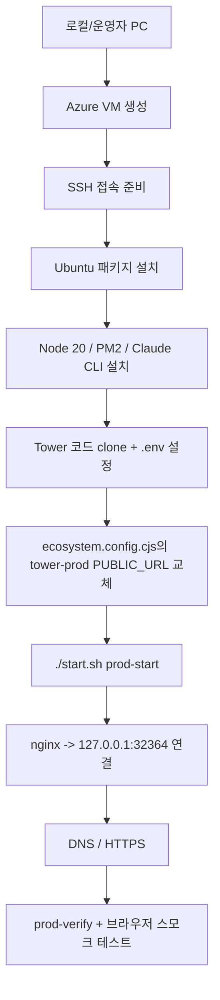

# Azure VM Tower 프로덕션 배포 가이드

이 문서는 **새 Azure VM 생성 → Tower 프로덕션 설치 → nginx 연결 → 검증**까지 한 번에 진행하는 기준 문서다.

현재 저장소 기준의 중요한 사실:

- **실제 프로덕션 PM2 인스턴스는 `tower-prod`** 이다.
- **실제 프로덕션 시작 명령은 `./start.sh prod-start` / `./start.sh prod-restart`** 이다.
- `./start.sh start` 는 현재 저장소에서 dev PM2 인스턴스(`tower`, `:32354`)를 띄운다.
- 프로덕션 포트는 **`:32364`**, 외부 노출은 **nginx + 도메인** 으로 처리한다.
- `ecosystem.config.cjs` 에 `tower-prod`용 `PUBLIC_URL` 값이 있으므로, **새 도메인으로 부트스트랩 시 반드시 갱신**해야 한다.

---

## 배포 방식 요약



---

## 제공 스크립트

| 스크립트 | 역할 |
|---|---|
| `scripts/azure/create-vm.sh` | Azure VM + NSG 포트(22/80/443) 생성 |
| `scripts/azure/bootstrap-prod.sh` | VM 내부에서 Tower prod 설치/설정/nginx/검증 수행 |
| `scripts/azure/deploy-e2e.sh` | VM 생성부터 원격 bootstrap까지 한 번에 실행 |

---

## 방법 1: 전 과정을 한 번에 실행

운영자 PC에 `az`, `ssh`, `scp`가 준비되어 있다고 가정한다.

```bash
bash scripts/azure/deploy-e2e.sh \
  --resource-group tower-rg \
  --location koreacentral \
  --vm-name okusystem \
  --admin-user azureuser \
  --size Standard_B2s \
  --repo-url git@github.com:your-org/tower.git \
  --domain tower.example.com \
  --ssl-mode cloudflare
```

### certbot 직접 HTTPS를 쓸 경우

```bash
bash scripts/azure/deploy-e2e.sh \
  --resource-group tower-rg \
  --location koreacentral \
  --vm-name okusystem \
  --admin-user azureuser \
  --size Standard_B2s \
  --repo-url git@github.com:your-org/tower.git \
  --domain tower.example.com \
  --ssl-mode certbot \
  --certbot-email ops@example.com
```

### 기존 VM에 앱만 설치할 경우

```bash
bash scripts/azure/deploy-e2e.sh \
  --skip-vm-create \
  --existing-host 20.249.10.11 \
  --admin-user azureuser \
  --repo-url git@github.com:your-org/tower.git \
  --domain tower.example.com
```

---

## 방법 2: 단계별로 실행

### 1) VM 생성

```bash
bash scripts/azure/create-vm.sh \
  --resource-group tower-rg \
  --location koreacentral \
  --vm-name okusystem \
  --admin-user azureuser \
  --size Standard_B2s
```

### 2) SSH 접속

```bash
ssh azureuser@<VM_PUBLIC_IP>
```

### 3) 서버 내부에서 부트스트랩

```bash
cd ~/tower
bash scripts/azure/bootstrap-prod.sh \
  --repo-url git@github.com:your-org/tower.git \
  --domain tower.example.com \
  --ssl-mode cloudflare
```

> 저장소가 아직 VM에 없다면, 운영자 PC에서 먼저 bootstrap 스크립트를 복사해서 실행해도 된다.

예:

```bash
scp scripts/azure/bootstrap-prod.sh azureuser@<VM_PUBLIC_IP>:/tmp/bootstrap-prod.sh
ssh azureuser@<VM_PUBLIC_IP>
bash /tmp/bootstrap-prod.sh \
  --repo-url git@github.com:your-org/tower.git \
  --domain tower.example.com \
  --ssl-mode cloudflare
```

---

## 선택 입력값

### API 키를 환경변수로 전달

민감한 값은 커맨드 라인에 직접 쓰지 말고, 현재 셸에서 export 후 실행한다.

```bash
export ANTHROPIC_API_KEY='...'
export OPENROUTER_API_KEY='...'
export PI_ENABLED=true
export DEFAULT_ENGINE=claude
```

그 다음 `deploy-e2e.sh` 또는 `bootstrap-prod.sh` 를 실행한다.

---

## 이 스크립트가 자동으로 처리하는 것

- Ubuntu 필수 패키지 설치
- Node.js 20 설치
- PM2 설치
- Claude Code CLI 설치
- Tower clone/pull
- `npm install`
- `.env` 생성 및 필수값 반영
- `JWT_SECRET` 자동 생성
- `PUBLIC_URL=https://<domain>` 반영
- `ecosystem.config.cjs` 의 `tower-prod` `PUBLIC_URL` 갱신
- workspace 템플릿 준비
- `npm run build`
- `./start.sh prod-start`
- nginx site 작성 및 reload
- `./start.sh prod-verify`

---

## 자동화되지 않는 단계

다음은 구조상 사람이 확인해야 한다.

1. **DNS A 레코드 연결**
   - `<domain> -> VM Public IP`
2. **Cloudflare 설정**
   - Proxy on/off, SSL mode 결정
3. **Claude 인증**
   - Max/Pro 로그인 기반이면 `claude auth login` 필요
   - 또는 `ANTHROPIC_API_KEY` 제공
4. **브라우저 스모크 테스트**
   - 첫 관리자 계정 생성
   - WebSocket 상태 확인
   - 실제 채팅 전송

---

## 설치 후 검증

```bash
ssh azureuser@<VM_PUBLIC_IP>
cd ~/apps/tower
./start.sh prod-status
./start.sh prod-verify
./start.sh prod-logs 100
curl -s http://127.0.0.1:32364/api/health
```

브라우저에서는 다음을 확인한다.

- `https://<domain>` 접속 가능
- 첫 계정 생성 시 admin 부여
- 좌하단 상태 `Ready`
- 테스트 메시지 응답 정상
- Files 탭에서 workspace 표시

---

## 권장 배포 파라미터

```datatable
{
  "columns": ["항목", "권장값", "설명"],
  "data": [
    ["OS", "Ubuntu 22.04 LTS", "문서와 스크립트가 이 기준으로 작성됨"],
    ["VM Size", "Standard_B2s 이상", "최소 prod 구동 가능. 여유 운영은 4GB RAM 권장"],
    ["Port", "32364", "Tower prod 내부 포트"],
    ["External Inbound", "22, 80, 443", "32364는 외부 오픈하지 않는 편이 안전"],
    ["HTTPS", "Cloudflare 또는 certbot", "Cloudflare가 현재 운영 패턴과 가장 유사"],
    ["PM2 Process", "tower-prod", "실제 프로덕션 프로세스명"]
  ]
}
```

---

## 추천 운영 순서

1. `deploy-e2e.sh`로 인프라 + 서버 부트스트랩
2. DNS 연결
3. Claude 인증 확인
4. 브라우저 스모크 테스트
5. 백업/모니터링 추가

---

## 주의

- `./start.sh start` 와 `./start.sh prod-start` 를 혼동하지 말 것
- prod 서버는 `32364` 기준으로 본다
- 새 도메인 배포 전 `tower-prod`의 `PUBLIC_URL` 미수정 상태로 올리면 공유 링크가 잘못될 수 있다
- 실제 운영 배포는 `./start.sh prod-restart` 기준으로 본다
