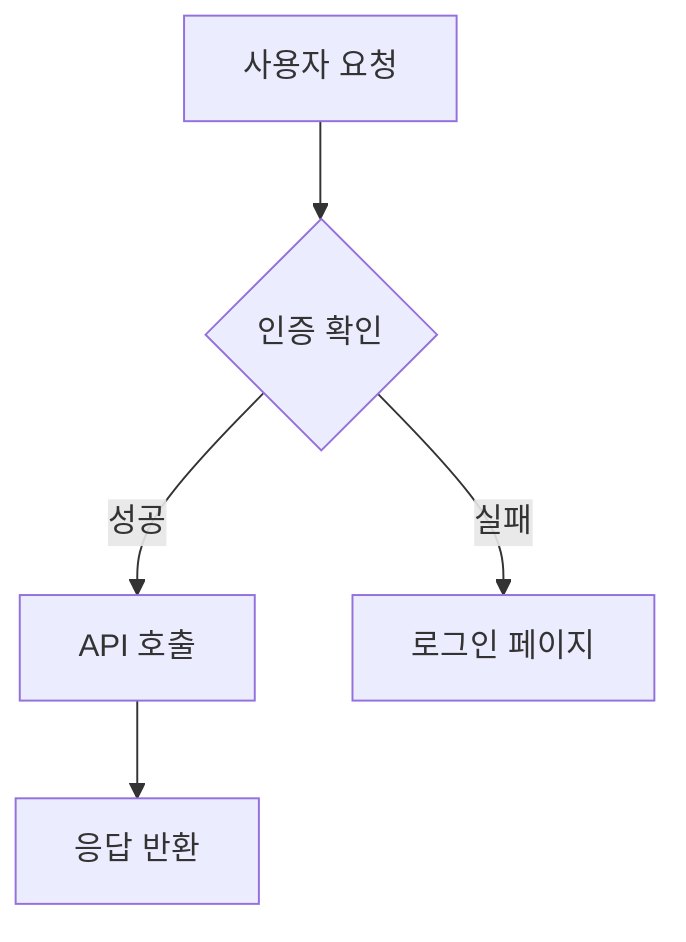
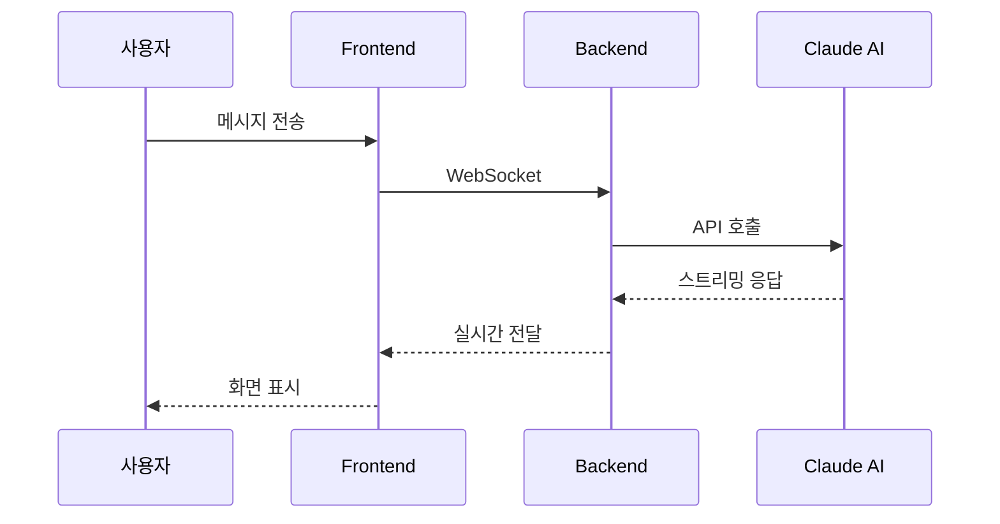

# Visual Blocks — 시각화

> AI 응답에 포함된 시각화 블록은 자동으로 렌더링됩니다. 차트, 다이어그램, 테이블, 지도 등 다양한 형식을 지원합니다.

---

## 어떻게 동작하나?

AI에게 시각화를 요청하면, AI가 응답에 특수 코드블록을 포함합니다. Tower는 이 블록을 감지하여 자동으로 인터랙티브 컴포넌트로 렌더링합니다.

- 코드블록이 닫히는 즉시 렌더링됩니다 (스트리밍 중에도)
- JSON 파싱에 실패하면 원본 코드블록이 그대로 표시됩니다 (에러 없음)
- 사용하지 않는 시각화 컴포넌트는 로드하지 않아 성능에 영향이 없습니다

**AI에게 "차트로 보여줘", "다이어그램으로 그려줘", "표로 정리해줘" 같이 요청하면 자동으로 적절한 블록을 사용합니다.**

---

## Chart — 차트

데이터를 시각적인 차트로 표현합니다.

**지원 타입:** `bar`, `line`, `area`, `pie`, `scatter`, `radar`, `composed`

### Bar Chart 예시

````
```chart
{
  "type": "bar",
  "data": [
    { "month": "1월", "매출": 120, "비용": 80 },
    { "month": "2월", "매출": 150, "비용": 90 },
    { "month": "3월", "매출": 180, "비용": 95 },
    { "month": "4월", "매출": 200, "비용": 100 }
  ],
  "xKey": "month",
  "yKey": ["매출", "비용"]
}
```
````

### Line Chart 예시

````
```chart
{
  "type": "line",
  "data": [
    { "day": "Mon", "visitors": 420 },
    { "day": "Tue", "visitors": 380 },
    { "day": "Wed", "visitors": 510 },
    { "day": "Thu", "visitors": 490 },
    { "day": "Fri", "visitors": 600 }
  ],
  "xKey": "day",
  "yKey": "visitors"
}
```
````

### Pie Chart 예시

````
```chart
{
  "type": "pie",
  "data": [
    { "name": "TypeScript", "value": 45 },
    { "name": "Python", "value": 30 },
    { "name": "Go", "value": 15 },
    { "name": "Rust", "value": 10 }
  ],
  "xKey": "name",
  "yKey": "value"
}
```
````

---

## Mermaid — 다이어그램

Mermaid 문법으로 다양한 다이어그램을 그립니다.

**지원 타입:** flowchart, sequence, class, ER, gantt, mindmap 등

### Flowchart 예시

````

````

### Sequence Diagram 예시

````

````

---

## DataTable — 데이터 테이블

정렬, 검색이 가능한 인터랙티브 테이블입니다.

````
```datatable
{
  "columns": ["이름", "부서", "직급", "입사일"],
  "data": [
    ["김철수", "개발팀", "시니어", "2023-03-15"],
    ["이영희", "디자인팀", "리드", "2022-08-01"],
    ["박민수", "개발팀", "주니어", "2024-01-10"],
    ["최지은", "기획팀", "매니저", "2021-11-20"]
  ]
}
```
````

- 컬럼 헤더를 클릭하면 정렬됩니다
- 검색창에서 데이터를 필터링할 수 있습니다
- 페이지네이션 지원 (대량 데이터)

---

## Timeline — 타임라인

시간 순서대로 이벤트를 표시합니다.

````
```timeline
{
  "items": [
    { "date": "2024-01", "title": "프로젝트 킥오프", "status": "done" },
    { "date": "2024-02", "title": "MVP 개발", "status": "done" },
    { "date": "2024-03", "title": "베타 테스트", "status": "active" },
    { "date": "2024-04", "title": "정식 출시", "status": "pending" }
  ]
}
```
````

status 값: `done` (완료), `active` (진행 중), `pending` (예정)

---

## Diff — 코드 비교

코드 변경 사항을 비교하여 보여줍니다.

````
```diff
{
  "before": "function add(a, b) {\n  return a + b;\n}",
  "after": "function add(a: number, b: number): number {\n  return a + b;\n}",
  "mode": "split"
}
```
````

mode 값: `split` (좌우 분리), `unified` (통합)

---

## Kanban — 임베디드 칸반

AI 응답 안에 작은 칸반 보드를 표시합니다.

````
```kanban
{
  "columns": ["해야 할 일", "진행 중", "완료"],
  "cards": [
    { "title": "API 엔드포인트 설계", "column": "완료" },
    { "title": "프론트엔드 연동", "column": "진행 중" },
    { "title": "테스트 작성", "column": "해야 할 일" },
    { "title": "배포 스크립트", "column": "해야 할 일" }
  ]
}
```
````

---

## Map — 지도

Leaflet 기반의 인터랙티브 지도를 표시합니다.

````
```map
{
  "center": [37.5665, 126.9780],
  "zoom": 13,
  "markers": [
    { "lat": 37.5665, "lng": 126.9780, "label": "서울시청" },
    { "lat": 37.5512, "lng": 126.9882, "label": "남산타워" }
  ]
}
```
````

마커 클릭, 줌, 패닝 등 기본 지도 인터랙션을 지원합니다.

---

## Steps — 단계별 체크리스트

프로세스의 단계와 진행 상태를 보여줍니다.

````
```steps
{
  "steps": [
    { "title": "요구사항 분석", "status": "done" },
    { "title": "아키텍처 설계", "status": "done" },
    { "title": "구현", "status": "active" },
    { "title": "테스트", "status": "pending" },
    { "title": "배포", "status": "pending" }
  ],
  "current": 2
}
```
````

---

## Terminal — 명령어 출력

터미널 실행 결과를 보기 좋게 표시합니다.

````
```terminal
{
  "commands": [
    { "cmd": "npm run build", "output": "Build completed in 3.2s", "status": "success" },
    { "cmd": "npm test", "output": "42 tests passed, 0 failed", "status": "success" },
    { "cmd": "npm run lint", "output": "2 warnings found", "status": "warning" }
  ]
}
```
````

status 값: `success` (성공), `error` (실패), `warning` (경고)

---

## Comparison — 비교 카드

여러 옵션을 비교할 때 사용합니다.

````
```comparison
{
  "items": [
    {
      "name": "PostgreSQL",
      "pros": ["ACID 트랜잭션", "복잡한 쿼리 지원", "확장성"],
      "cons": ["수평 확장 어려움", "설정 복잡"],
      "score": 8.5
    },
    {
      "name": "MongoDB",
      "pros": ["유연한 스키마", "수평 확장 용이", "빠른 개발"],
      "cons": ["트랜잭션 제한", "메모리 사용량"],
      "score": 7.8
    }
  ]
}
```
````

---

## Form — 인터랙티브 폼

사용자 입력을 받는 폼을 표시합니다.

````
```form
{
  "fields": [
    { "key": "name", "type": "text", "label": "프로젝트 이름" },
    { "key": "language", "type": "select", "label": "언어", "options": ["TypeScript", "Python", "Go", "Rust"] },
    { "key": "description", "type": "textarea", "label": "설명" },
    { "key": "isPublic", "type": "checkbox", "label": "공개 프로젝트" }
  ]
}
```
````

---

## Gallery — 이미지 갤러리

이미지를 그리드 레이아웃으로 보여줍니다.

````
```gallery
{
  "images": [
    { "src": "/files/screenshot1.png", "caption": "메인 화면" },
    { "src": "/files/screenshot2.png", "caption": "설정 페이지" },
    { "src": "/files/screenshot3.png", "caption": "대시보드" }
  ],
  "columns": 3
}
```
````

---

## HTML Sandbox — HTML 실행

HTML, CSS, JavaScript를 iframe sandbox 안에서 실행합니다.

````
```html-sandbox
<style>
  .box {
    width: 100px;
    height: 100px;
    background: linear-gradient(135deg, #667eea 0%, #764ba2 100%);
    border-radius: 12px;
    animation: spin 2s infinite linear;
  }
  @keyframes spin {
    from { transform: rotate(0deg); }
    to { transform: rotate(360deg); }
  }
</style>
<div class="box"></div>
```
````

보안을 위해 sandbox 환경에서 실행되므로 외부 리소스 접근이 제한됩니다.

---

## Treemap — 트리맵

계층적 데이터를 크기 비례 영역으로 시각화합니다.

````
```treemap
{
  "data": [
    {
      "name": "Frontend",
      "value": 4500,
      "children": [
        { "name": "Components", "value": 2000 },
        { "name": "Hooks", "value": 1500 },
        { "name": "Styles", "value": 1000 }
      ]
    },
    {
      "name": "Backend",
      "value": 3000,
      "children": [
        { "name": "Services", "value": 1800 },
        { "name": "Routes", "value": 1200 }
      ]
    }
  ]
}
```
````

---

## LaTeX 수식

수학 수식을 렌더링합니다. **블록 수식만 지원합니다.**

### 사용법

`$$`로 감싼 수식이 렌더링됩니다:

```
$$
E = mc^2
$$
```

```
$$
\int_{0}^{\infty} e^{-x^2} dx = \frac{\sqrt{\pi}}{2}
$$
```

> **참고:** 인라인 수식(`$...$`)은 비활성화되어 있습니다. 금융 데이터에서 달러 기호($)와 충돌하는 것을 방지하기 위해서입니다. 수식은 반드시 `$$...$$` 블록으로 작성하세요.

---

## 전체 블록 타입 요약

| 블록 | 코드블록 태그 | 주요 용도 |
|------|-------------|----------|
| Chart | `chart` | 바/라인/파이 등 데이터 차트 |
| Mermaid | `mermaid` | 플로우차트, 시퀀스 다이어그램 |
| DataTable | `datatable` | 정렬/검색 가능한 테이블 |
| Timeline | `timeline` | 시간순 이벤트 표시 |
| Diff | `diff` | 코드 변경 전후 비교 |
| Kanban | `kanban` | 칸반 보드 |
| Map | `map` | 지도 + 마커 |
| Steps | `steps` | 프로세스 단계 표시 |
| Terminal | `terminal` | 터미널 명령/출력 |
| Comparison | `comparison` | 옵션 비교 카드 |
| Form | `form` | 사용자 입력 폼 |
| Gallery | `gallery` | 이미지 그리드 |
| HTML Sandbox | `html-sandbox` | HTML/CSS/JS 실행 |
| Treemap | `treemap` | 계층적 데이터 시각화 |
| LaTeX | `$$...$$` | 수학 수식 |

---

## 팁

- **자연어로 요청하세요**: "매출 데이터를 바 차트로 보여줘"라고 하면 AI가 알아서 chart 블록을 사용합니다.
- **타입 지정 가능**: "파이 차트로"처럼 원하는 차트 타입을 명시하면 더 정확합니다.
- **복잡한 시각화**: "아키텍처를 Mermaid flowchart로 그려줘"처럼 구체적으로 요청하세요.
- **데이터 분석**: 표 형태 데이터를 주면서 "이걸 시각화해줘"라고 하면 적절한 차트를 선택해줍니다.
